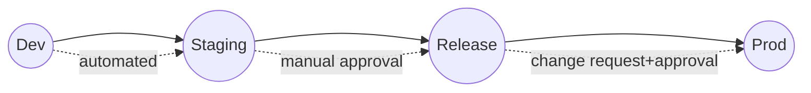

# Cloudnautic — AWS DevOps Solution Guide (Steps, Commands, Runbooks)
**Project:** Cloudnautic Customer‑Facing SaaS Pipeline (Planning → Dev → Staging → Release → Production)  
**Last Updated:** 2025‑09‑13

> ⚠️ Use a training AWS account or sandbox. Clean up non‑prod nightly to control costs.

---

## 0) Prerequisites
- AWS CLI v2, kubectl, helm, terraform (≥1.6), jq, docker, git
- GitHub repo with Admin rights
- Domain in Route 53 (optional for HTTPS demo), or use nip.io for quick tests
- **OIDC** GitHub→AWS configured (we’ll set it up below)

---

## 1) Planning Stage (Process Only)
- Define epics/issues: infra bootstrap, CI, app containerization, CD, observability, security.
- Create a BRD short doc (use `/docs`), architecture diagram (draw.io/mermaid).
- Decide environments and tagging conventions.

**Mermaid sketch (paste in README.md):**


---

## 2) Git & Branching
- Default branch: `main`
- Active development: `develop`
- Feature branches: `feat/*`, fixes: `fix/*`
- Merge `develop`→`main` via PR when releasing.

```bash
git init
git checkout -b develop
git remote add origin https://github.com/<org>/cloudnautic-aws-devops.git
git push -u origin develop
```

---

## 3) AWS Foundations with Terraform
**Directory:** `infra/terraform`

### 3.1 Providers & Backend (S3+DynamoDB)
`providers.tf` (snippet):
```hcl
terraform {
  required_version = ">= 1.6.0"
  backend "s3" {
    bucket         = "cloudnautic-tfstate-<uniq>"
    key            = "global/terraform.tfstate"
    region         = "ap-south-1"
    dynamodb_table = "cloudnautic-tflock"
    encrypt        = true
  }
}
provider "aws" { region = "ap-south-1" }
```

> Create the backend first (one‑time) using a local state init module or bootstrap script.

**Backend bootstrap (one‑time):**
```bash
AWS_REGION=ap-south-1
BUCKET=cloudnautic-tfstate-$(date +%s)
aws s3api create-bucket --bucket "$BUCKET" --create-bucket-configuration LocationConstraint=$AWS_REGION --region $AWS_REGION
aws s3api put-bucket-versioning --bucket "$BUCKET" --versioning-configuration Status=Enabled
aws s3api put-bucket-encryption --bucket "$BUCKET" --server-side-encryption-configuration '{"Rules":[{"ApplyServerSideEncryptionByDefault":{"SSEAlgorithm":"AES256"}}]}'
aws dynamodb create-table --table-name cloudnautic-tflock \
  --attribute-definitions AttributeName=LockID,AttributeType=S \
  --key-schema AttributeName=LockID,KeyType=HASH \
  --billing-mode PAY_PER_REQUEST --region $AWS_REGION
```

### 3.2 VPC Module (3‑tier, 2 AZs)
Module inputs:
```hcl
variable "vpc_cidr" { default = "10.0.0.0/16" }
variable "az_count" { default = 2 }
# create public + private subnets, NAT GW (1 for training), tags etc.
```

### 3.3 ECR, EKS (with IRSA), IAM, KMS
- **ECR:** repo per service (`api`, `ui`), scanOnPush=true.
- **EKS:** managed node groups (t3.small for training), control plane logs on, private nodes, public endpoint restricted by IP (or better: private endpoint + bastion).
- **IRSA:** map service accounts to IAM policies for S3/SSM/Secrets.
- **KMS:** CMK for EKS secrets/encrypt etc.

**Init & Apply per env (workspaces)**
```bash
cd infra/terraform
terraform init
terraform workspace new dev || true
terraform workspace select dev
terraform apply -var-file=envs/dev.tfvars -auto-approve
# Repeat for staging, release, prod with their tfvars
```

---

## 4) Containerizing the App
**API (Flask) — `app/api/Dockerfile`**
```dockerfile
FROM python:3.12-slim
WORKDIR /app
COPY requirements.txt .
RUN pip install --no-cache-dir -r requirements.txt
COPY . .
ENV PORT=8080
EXPOSE 8080
CMD ["python", "app.py"]
```

**Minimal `app.py`:**
```python
from flask import Flask
app = Flask(__name__)

@app.get("/healthz")
def health():
    return {"status": "ok"}, 200

@app.get("/")
def root():
    return {"service": "cloudnautic-api"}, 200

if __name__ == "__main__":
    app.run(host="0.0.0.0", port=8080)
```

**UI (React) — `app/ui/Dockerfile` (example build then serve):**
```dockerfile
FROM node:20 as build
WORKDIR /ui
COPY package*.json ./
RUN npm ci
COPY . .
RUN npm run build

FROM nginx:stable-alpine
COPY --from=build /ui/dist /usr/share/nginx/html
EXPOSE 80
```

---

## 5) GitHub→AWS OIDC (No Long‑Lived Keys)
1. In AWS, create an IAM OIDC provider for GitHub (`token.actions.githubusercontent.com`).
2. Create IAM role `CloudnauticGitHubActionsRole` with trust policy limiting `repo:<org>/<repo>`, branches/tags as needed.
3. Attach least‑privilege policies (ECR push, EKS describe, S3/SSM/Secrets as required).

**Sample trust policy (edit repo/branch):**
```json
{
  "Version": "2012-10-17",
  "Statement": [
    {
      "Effect": "Allow",
      "Principal": { "Federated": "arn:aws:iam::<ACCOUNT_ID>:oidc-provider/token.actions.githubusercontent.com" },
      "Action": "sts:AssumeRoleWithWebIdentity",
      "Condition": {
        "StringEquals": { "token.actions.githubusercontent.com:aud": "sts.amazonaws.com" },
        "StringLike": {
          "token.actions.githubusercontent.com:sub": "repo:<ORG>/<REPO>:ref:refs/heads/*"
        }
      }
    }
  ]
}
```

In GitHub Actions, assume role:
```yaml
permissions:
  id-token: write
  contents: read
- name: Configure AWS credentials
  uses: aws-actions/configure-aws-credentials@v4
  with:
    role-to-assume: arn:aws:iam::<ACCOUNT_ID>:role/CloudnauticGitHubActionsRole
    aws-region: ap-south-1
```

---

## 6) CI: Build, Test, Scan, Push
`.github/workflows/ci.yml`
```yaml
name: CI
on:
  pull_request:
    branches: [ develop, main ]
  push:
    branches: [ develop ]

jobs:
  build-test:
    runs-on: ubuntu-latest
    permissions: { contents: read, id-token: write }
    steps:
      - uses: actions/checkout@v4

      - name: Set up Python
        uses: actions/setup-python@v5
        with: { python-version: '3.12' }

      - name: Install API deps
        run: |
          python -m pip install --upgrade pip
          pip install -r app/api/requirements.txt
          pytest -q || true  # replace with real tests

      - name: Docker build (API)
        run: |
          docker build -t api:${{ github.sha }} app/api
          docker build -t ui:${{ github.sha }} app/ui

      - name: Configure AWS credentials
        uses: aws-actions/configure-aws-credentials@v4
        with:
          role-to-assume: arn:aws:iam::<ACCOUNT_ID>:role/CloudnauticGitHubActionsRole
          aws-region: ap-south-1

      - name: Login to ECR
        id: ecr
        uses: aws-actions/amazon-ecr-login@v2

      - name: Push images
        run: |
          API_REPO=<ACCOUNT_ID>.dkr.ecr.ap-south-1.amazonaws.com/cloudnautic-api
          UI_REPO=<ACCOUNT_ID>.dkr.ecr.ap-south-1.amazonaws.com/cloudnautic-ui
          docker tag api:${{ github.sha }} $API_REPO:${{ github.sha }}
          docker tag ui:${{ github.sha }}  $UI_REPO:${{ github.sha }}
          docker push $API_REPO:${{ github.sha }}
          docker push $UI_REPO:${{ github.sha }}
```

---

## 7) CD: Helm Deploy to EKS (Env‑Gated)
`.github/workflows/cd.yml`
```yaml
name: CD
on:
  push:
    branches: [ develop ]
  workflow_dispatch:
  release:
    types: [published]  # for prod promotion via tag vX.Y.Z

jobs:
  deploy-dev:
    if: github.ref == 'refs/heads/develop'
    runs-on: ubuntu-latest
    permissions: { contents: read, id-token: write }
    steps:
      - uses: actions/checkout@v4
      - uses: aws-actions/configure-aws-credentials@v4
        with:
          role-to-assume: arn:aws:iam::<ACCOUNT_ID>:role/CloudnauticGitHubActionsRole
          aws-region: ap-south-1
      - name: Update kubeconfig
        run: aws eks update-kubeconfig --name cloudnautic-eks --region ap-south-1
      - name: Install Helm
        uses: azure/setup-helm@v4
      - name: Deploy to dev
        run: |
          IMG_TAG=${{ github.sha }}
          helm upgrade --install cloudnautic chart/ \
            -n dev --create-namespace \
            -f chart/values-dev.yaml \
            --set image.api.tag=$IMG_TAG \
            --set image.ui.tag=$IMG_TAG

  deploy-staging:
    needs: deploy-dev
    runs-on: ubuntu-latest
    environment: staging   # requires manual approval in GitHub
    steps: [ ... similar with values-staging.yaml ... ]

  deploy-release:
    needs: deploy-staging
    runs-on: ubuntu-latest
    environment: release   # manual approval
    steps: [ ... values-release.yaml ... ]

  deploy-prod:
    if: startsWith(github.ref, 'refs/tags/v')
    runs-on: ubuntu-latest
    environment: production # manual approval + change record
    steps: [ ... values-prod.yaml ... ]
```

**Helm chart values override example** (`chart/values-dev.yaml`):
```yaml
image:
  api:
    repository: <ACCOUNT_ID>.dkr.ecr.ap-south-1.amazonaws.com/cloudnautic-api
    tag: "latest"  # overridden in pipeline
  ui:
    repository: <ACCOUNT_ID>.dkr.ecr.ap-south-1.amazonaws.com/cloudnautic-ui
    tag: "latest"

ingress:
  enabled: true
  className: alb
  hosts: [ "dev.cloudnautic.example.com" ]
  tls: true
```

---

## 8) Ingress & TLS
- Install AWS Load Balancer Controller via Helm (IRSA required).
```bash
# IRSA + controller install (abbrev)
helm repo add eks https://aws.github.io/eks-charts
helm upgrade --install aws-load-balancer-controller eks/aws-load-balancer-controller \
  -n kube-system \
  --set clusterName=cloudnautic-eks \
  --set serviceAccount.create=false \
  --set serviceAccount.name=aws-load-balancer-controller
```
- Request ACM cert for `*.cloudnautic.example.com`, attach via Ingress annotations/Helm values.

---

## 9) Database & Secrets (Optional)
- Create RDS Postgres or Aurora Serverless v2 in private subnets.
- App gets credentials from **AWS Secrets Manager** or **SSM Parameter Store** via IRSA.
```bash
aws secretsmanager create-secret --name cloudnautic/dev/db \
  --secret-string '{"username":"app","password":"StrongPassw0rd","host":"db.dev.local","port":5432,"dbname":"app"}'
```
- Mount via env vars or projected files in Deployment.

---

## 10) Observability (CW + Optional Prom/Graf)
**CloudWatch Logs:** Enable fluent-bit DaemonSet or EKS add‑on (or stdout -> Container Insights).  
**Alarms (examples):**
```bash
aws cloudwatch put-metric-alarm \
  --alarm-name "alb-5xx-dev" \
  --metric-name HTTPCode_ELB_5XX_Count \
  --namespace AWS/ApplicationELB \
  --statistic Sum --period 60 --threshold 5 --comparison-operator GreaterThanThreshold \
  --dimensions Name=LoadBalancer,Value=<alb-dimension> \
  --evaluation-periods 1 --alarm-actions <sns-arn>
```

---

## 11) Promotion & Release Flow
- **Dev:** Auto on merge to `develop`
- **Staging:** Manual approve in GitHub environment
- **Release:** Manual approve; smoke/regression runbooks executed
- **Production:** Create a GitHub **release tag `vX.Y.Z`** → auto deploy with final approval

**Tag & release:**
```bash
git checkout main
git pull
git tag -a v1.0.0 -m "First prod release"
git push origin v1.0.0
```

---

## 12) Rollback
```bash
# Find previous release
helm history cloudnautic -n prod
# Roll back to N-1
helm rollback cloudnautic <REVISION> -n prod
# Verify
kubectl -n prod get pods,svc,ingress
```

---

## 13) Runbooks (Snippets)
**Post‑deploy checks:**
```bash
kubectl -n <env> get deploy,po,svc,ing
kubectl -n <env> rollout status deploy/cloudnautic-api --timeout=120s
curl -I https://<env>.cloudnautic.example.com/healthz
```

**Blue/Green or Canary (bonus):** Use extra Helm values for canary Deployment with small weight behind ALB target group.

---

## 14) Cleanup
```bash
# Delete env namespace (app only)
kubectl delete ns dev
# Delete ECR images (training only)
aws ecr list-images --repository-name cloudnautic-api | jq -r '.imageIds[]|@json' | \
  xargs -I {} aws ecr batch-delete-image --repository-name cloudnautic-api --image-ids '{}'
# Terraform destroy (infra)
cd infra/terraform && terraform workspace select dev && terraform destroy
```

---

## 15) Intern Task List (Checkpoints)
- ✅ Provision `dev` infra via Terraform
- ✅ Push CI images to ECR
- ✅ Deploy to `dev` via Helm
- ✅ Configure Ingress + HTTPS
- ✅ Set alarms & test a rollback
- ✅ Document every step in PRs with screenshots

---

### Appendix — Minimal Helm Chart Skeleton
```
chart/
 ├─ Chart.yaml
 ├─ templates/
 │   ├─ deployment-api.yaml
 │   ├─ deployment-ui.yaml
 │   ├─ service.yaml
 │   └─ ingress.yaml
 ├─ values.yaml
 ├─ values-dev.yaml
 ├─ values-staging.yaml
 ├─ values-release.yaml
 └─ values-prod.yaml
```
